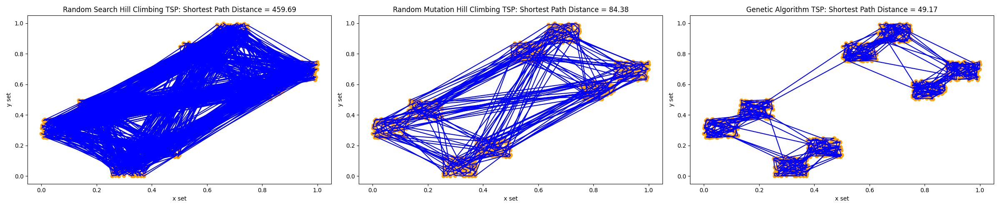

MECCS4510 - Traveling Salesman Problem

Solve this traveling salesman problem file with 1000 datapoints using your
evolutionary algorithm. Try different variations of GA.

- Random Search
- Random Mutation Hill Climber
- Genetic Algorithm (Roulette Wheel Selection)
- Genetic Algorithm (Tournament Selection)
- Genetic Algorithm (Tournament Selection & Hierarchical)

# Top Tip:
Make your own test file to debug your algorithm. For example: make a file of
coordinates sampled from a circle or an ellipse, so the solution is obvious.
